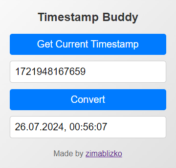

  

  <h3 align="center">Timestamp Buddy</h3>

  

    Simple Chrome extension for easy work with timestamps.
     
  

## Usage

Timestamp Buddy has two usecases:

1. Extension popup lets user to convert timestamp to readable date:
    
   
    
    
2. Also user can select a timestamp on any page and convert it to date via context menu.

## Contact

LinkedIn - [@nikolaev-evgenii](https://www.linkedin.com/in/nikolaev-evgenii/)

Telegram - [@heavyheavyrain](https://t.me/heavyheavyrain)

Project Link: [https://github.com/zimablizko/timestamp-buddy](https://github.com/zimablizko/timestamp-buddy)

## Contributing

Pull requests and Issues are welcome.

## License

[MIT](https://choosealicense.com/licenses/mit/)
